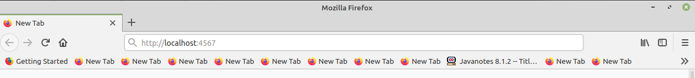

# Display a photo gallery using the Spark Framework

Type in this url into your browser:

<br /><br />
Photo gallery is displayed:


<br />

For this project, I am using
- Maven Build Tool
- Visual Studio Code

## What is Spark?
Spark is a Micro-framework that allows you to spin up a web server. Do not confuse the "Spark" framework with the database "Apache Spark".
They just happen to share the same name.<br />
<b>Documentation<b>: http://sparkjava.com/ 

## Instructions for creating this project

- Create a folder called "first_spark_app"
- Navigate to the "first_spark_app" directory from the terminal.

Inside the first_spark_app directory:
- Create a new directory called "my_app" and navigate to that directory from the terminal.
- Inside the my_app directory, create a pom.xml file.

- Go to the documentation at http://sparkjava.com/tutorials/maven-setup and copy their example of a pom.xml file into your own. 

- Edit the artifactid to say "my_app" and groupid to say "com.leehaney" (add your own name instead of mine). Your artifactid is the root folder of your project. Your root
folder is what contains your pom.xml file and src folder. It is where you will compile
and run your project.

- Be sure to include the following dependency to your pom.xml dependencies:

        <dependency>
            <groupId>org.slf4j</groupId>
            <artifactId>slf4j-jdk14</artifactId>
            <version>1.7.30</version>
        </dependency>


- Add the following directories and java file with these commands (from the my_app directory):<br />
$ mkdir src; mkdir src/main; mkdir src/main/java; mkdir src/main/java/com; mkdir src/main/java/com/leehaney; touch src/main/java/com/leehaney/App.java<br />
$ mkdir src/main/resources <br />
$ mkdir src/main/resources/public

### Add this code to your App.java file
        package com.leehaney;

        import java.util.HashMap;
        import java.util.Map;

        import static spark.Spark.*;
        import spark.ModelAndView;

        public class App {
            public static void main(String[] args) {
                // staticFileLocation() tells Spark where to look for your HTML, CSS, and JS files. 
                // the public directory must be inside of the resources directory.
                staticFileLocation("/public"); 

                get("/", (req, res) -> {
                    return new ModelAndView(null, "index.html");
                });

            }  
        }

Add all of your HTML, CSS, JavaScript, and images inside of your my_app/src/main/resources/public directory!

- Run the following command (from the same folder as the pom.xml file)
```
 $ mvn compile
```
- A target directory should appear inside of my_app directory. (If needed) run the "mvn clean install" command
```
mvn exec:java -Dexec.mainClass="com.leehaney.App"
```
TIP: Run this command to make it so you only have to type "run" in order to run the program:<br />
```
$ alias run='mvn exec:java -Dexec.mainClass="com.leehaney.App"' 
$ run 
```
NOTE: Make sure the top of the App.java file includes "package com.leehaney;" <br />
In the browser, type in:
        
```
http://localhost:4567
```
or
```
http://0.0.0.0:4567
```
The web page should appear. 

<br />
<br />
<br />

If you see the following error message:

SLF4J: Failed to load class "org.slf4j.impl.StaticLoggerBinder".<br>
SLF4J: Defaulting to no-operation (NOP) logger implementation<br>
SLF4J: See http://www.slf4j.org/codes.html#StaticLoggerBinder for further details.<br>

It means you need to include an slf4j logging implementation in your maven dependencies
For example, add the following to your pom.xml dependencies:

        <dependency>
            <groupId>org.slf4j</groupId>
            <artifactId>slf4j-jdk14</artifactId>
            <version>1.7.30</version>
        </dependency>
        
<br />
If you are using Gradle as your build tool instead, this gradle file should work for you: <br />

        plugins {
            id 'java'
        }

        group 'com.leehaney'
        version '1.0-SNAPSHOT'

        repositories {
            mavenCentral()
        }

        dependencies {
            compile 'com.sparkjava:spark-core:2.9.3'
            compile group: 'org.slf4j', name: 'slf4j-jdk14', version: '1.7.29'
            testImplementation 'org.junit.jupiter:junit-jupiter-api:5.6.0'
            testRuntimeOnly 'org.junit.jupiter:junit-jupiter-engine'
        }

        test {
            useJUnitPlatform()
        }
